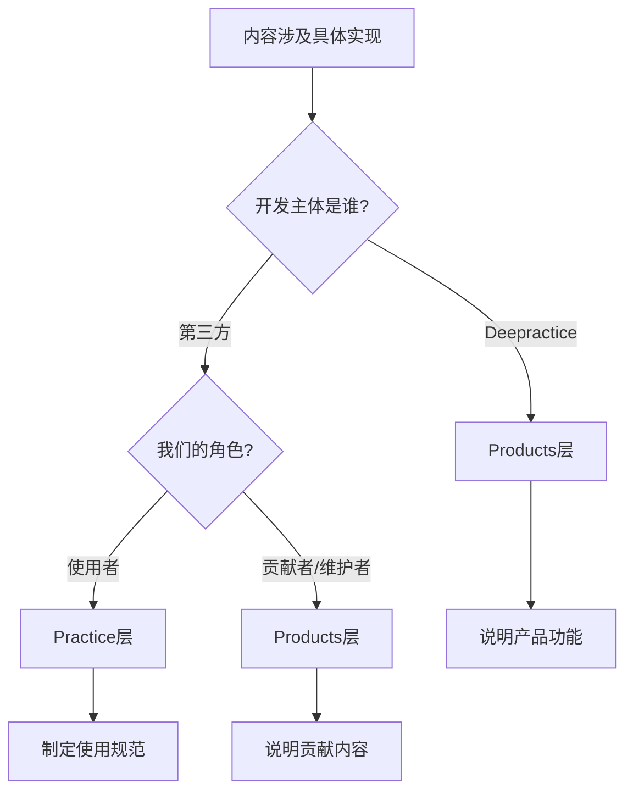

# 内容定位规范

## 概述

每篇文档必须有清晰的定位，通过双重坐标系统精确定义其在内容体系中的位置和作用。

## 三维定位系统

内容定位需要从三个维度明确定义：层级（Where）、类型（How）、目标（What & Why）。

### 维度一：层级定位（四层体系）

| 层级 | 英文 | 内容类型 | 关键问题 |
|------|------|---------|---------|
| **模式层** | Pattern | 理念、哲学、思想 | 为什么这样想？ |
| **协议层** | Protocol | 交互规则、通信约定 | 如何沟通协作？ |
| **实践层** | Practice | 执行标准、最佳实践 | 如何具体执行？ |
| **产品层** | Products | 实例、案例、实现 | 实际怎么用？ |

### 维度二：类型定位（Diátaxis框架）

| 类型 | 目的 | 读者状态 | 关键特征 |
|------|------|----------|----------|
| **Tutorial** | 学习技能 | 新手学习 | 引导练习、建立信心 |
| **How-to** | 解决问题 | 有任务要完成 | 步骤明确、直达目标 |
| **Explanation** | 理解原理 | 想要理解 | 概念解释、背景说明 |
| **Reference** | 查询信息 | 需要查找 | 结构化、易检索 |

### 维度三：目标定位（PSO框架）

每个文档需要明确定义其目标、范围和预期成果：

| 要素 | 英文 | 关键问题 | 定义内容 |
|------|------|----------|----------|
| **目的** | Purpose | 为什么需要这个文档？ | 解决什么问题、满足什么需求 |
| **范围** | Scope | 包含什么，不包含什么？ | 内容边界、依赖关系 |
| **成果** | Outcome | 读者能获得什么？ | 具体能力、可验证结果 |

#### PSO 示例

```yaml
# Monorepo 文档的 PSO
purpose: 帮助团队搭建和维护高效的 Monorepo 项目结构
scope:
  includes:
    - pnpm workspace 配置
    - Turborepo 任务编排
    - 包依赖管理
  excludes:
    - TypeScript 语言特性（→ TypeScript 规范）
    - CI/CD 完整配置（→ DevOps 规范）
outcome:
  - 能初始化 Monorepo 项目
  - 能配置包之间的依赖关系
  - 能执行并行构建任务
```

## 定位矩阵

### 层级与类型的优先组合

| 层级 | 主要类型 | 次要类型 | 说明 |
|------|----------|----------|------|
| **Pattern** | Explanation | Reference | 解释理念为主，术语定义为辅 |
| **Protocol** | Reference | Explanation | 规范定义为主，设计原理为辅 |
| **Practice** | Reference | Explanation | 执行标准为主，应用场景为辅 |
| **Products** | How-to | Tutorial | 操作指南为主，入门教程为辅 |

### 定位示例

```yaml
# Pattern层 + Explanation
layer: Pattern
type: Explanation
title: 理解Deepractice内容体系

# Practice层 + Reference  
layer: Practice
type: Reference
title: 文件命名规范

# Products层 + How-to
layer: Products
type: How-to
title: 如何部署文档网站
```

## 元数据规范

### 必需字段

| 字段 | 说明 | 取值范围 |
|------|------|----------|
| `layer` | 所属层级 | Pattern, Protocol, Practice, Products |
| `type` | 文档类型 | Tutorial, How-to, Explanation, Reference |
| `title` | 文档标题 | 简洁明确的标题 |
| `category` | 分类标签 | 所属的内容分类 |
| `status` | 发布状态 | draft, published, deprecated |
| `version` | 版本号 | 语义化版本号 |
| `date` | 更新日期 | YYYY-MM-DD格式 |

### 可选字段

| 字段 | 说明 | 使用场景 |
|------|------|----------|
| `author` | 作者信息 | 标注内容创作者 |
| `tags` | 标签列表 | 便于检索和分类 |
| `dependencies` | 依赖文档 | 标注前置阅读要求 |
| `related` | 相关文档 | 提供延伸阅读 |
| `purpose` | 文档目的 | 明确文档解决的问题 |
| `scope` | 内容范围 | 定义包含和排除的内容 |
| `outcome` | 预期成果 | 描述读者能获得的能力 |

### 完整示例

```yaml
---
layer: Practice
type: Reference
title: 内容定位规范
category: content-system
status: published
version: 1.2.0
date: 2025-01-14
author: Sean Jiang & Claude
tags:
  - 文档规范
  - 内容定位
  - 元数据
purpose: 定义文档在内容体系中的精确定位方法
scope:
  includes:
    - 层级定位（4P体系）
    - 类型定位（Diátaxis）
    - 目标定位（PSO）
  excludes:
    - 具体写作规范
    - 文档模板
outcome:
  - 能准确定位文档层级和类型
  - 能定义文档目标和边界
  - 能编写规范的元数据
dependencies:
  - /zh/patterns/content-system/understanding-content-system
related:
  - ./file-naming-convention.md
  - ./writing-explanation-standard.md
---
```

## 定位决策树

### 第一步：确定层级

1. 内容是关于**思想理念**？→ Pattern
2. 内容是关于**协作规则**？→ Protocol  
3. 内容是关于**执行标准**？→ Practice
4. 内容是关于**具体实现**？→ Products

### 第二步：确定类型

1. 要**教新手入门**？→ Tutorial
2. 要**解决具体问题**？→ How-to
3. 要**解释概念原理**？→ Explanation
4. 要**提供查询参考**？→ Reference

### 第三步：明确 PSO

1. **Purpose**：这个文档解决什么问题？
2. **Scope**：
   - Includes：必须包含哪些内容？
   - Excludes：明确不包含什么？
3. **Outcome**：读者看完能做什么？

### 第四步：验证合理性

检查是否符合层级与类型的优先组合矩阵。如不符合，需要重新考虑：
- 是否选错了层级？
- 是否选错了类型？
- 是否需要拆分成多篇文档？

### Products层特殊判断

在确定是否属于Products层时，使用以下决策树：



**典型场景**：
- ✅ Products层：PromptX使用手册、DeepracticeDocs部署指南
- ✅ Practice层：Git工作流规范、Docker使用标准、Nginx配置规范
- ⚠️ 边界情况：我们fork并深度定制的开源工具 → 视定制程度决定

## PSO 定义规范

### 统一原则

所有 PSO 定义都在文档的 frontmatter 中，包括：
- **文档级 PSO**：定义单个文档的边界
- **目录级 PSO**：在目录的 index.md 中定义整个目录的边界

### 必需规则

1. **每个目录必须有 index.md 文件**
2. **index.md 的 PSO 定义该目录的范围**
3. **PSO 三要素格式保持一致**

### PSO 标准格式

```yaml
# 三个核心字段（必需）
purpose: 一句话说明目的
scope:
  includes: 
    - 包含内容列表
  excludes:
    - 排除内容: → /建议位置/  # excludes 可选
outcome:
  - 预期成果列表
```

### 文档级 PSO 示例

```yaml
---
layer: Practice
type: Reference
title: 文档标题
# ... 其他元数据 ...

# 文档级 PSO
purpose: 定义文档在内容体系中的精确定位方法
scope:
  includes:
    - 层级定位（4P体系）
    - 类型定位（Diátaxis）
    - 目标定位（PSO）
  excludes:
    - 具体写作规范: → ./writing-reference-standard.md
    - 文档模板: → ./templates/
outcome:
  - 能准确定位文档层级和类型
  - 能定义文档目标和边界
---
```

### 目录级 PSO 示例

```yaml
# 目录的 index.md
---
layer: Practice
type: Reference  # 索引页通常是 Reference
title: 内容体系实践标准
# ... 其他元数据 ...

# 目录级 PSO（定义整个目录的边界）
purpose: 定义文档体系的撰写、组织和管理标准
scope:
  includes:
    - 文档定位方法
    - 各类型撰写规范
    - 文档校验标准
  excludes:
    - 具体业务文档: → /products/
    - 技术实现细节: → /practice/development-environment/
outcome:
  - 能准确定位和组织文档
  - 能撰写符合规范的各类文档
  - 能有效管理文档体系
---

# 内容体系实践标准

[目录介绍内容...]
```

### 层级示例

```
/practice/
├── index.md                    # Practice 层总体 PSO
├── content-system/
│   ├── index.md               # 内容体系目录 PSO
│   └── content-positioning-standard.md  # 具体文档 PSO
└── development-environment/
    ├── index.md               # 开发环境目录 PSO
    └── monorepo/
        ├── index.md           # Monorepo 子目录 PSO
        ├── monorepo-standard.md
        └── monorepo-configuration.md
```

## 特殊情况处理

### 跨层级内容

某些内容可能涉及多个层级：
- **优先原则**：按内容的主要关注点定位
- **拆分原则**：必要时拆分为多篇文档
- **链接原则**：通过交叉引用连接相关内容

### 混合类型内容

某些内容可能包含多种类型特征：
- **主类型原则**：选择最主要的类型
- **章节划分**：不同章节可以有不同侧重
- **明确标注**：在文档中说明各部分的作用

### 术语表定位

| 术语类型 | 所属层级 | 说明 |
|----------|----------|------|
| 理念术语 | Pattern | 核心思想概念 |
| 协议术语 | Protocol | 交互通信术语 |
| 实践术语 | Practice | 执行标准术语 |
| 产品术语 | Products | 产品功能术语 |

### 定位示例对比

| 内容描述 | 错误定位 | 正确定位 | 理由 |
|---------|---------|---------|------|
| Git工作流规范 | Products层 | Practice层 | Git是第三方工具，我们制定使用规范 |
| PromptX用户手册 | Practice层 | Products层 | PromptX是我们的产品 |
| VSCode配置标准 | Products层 | Practice层 | VSCode是第三方工具 |
| DeepracticeDocs主题开发 | Practice层 | Products层 | 我们自主开发的主题 |
| Kubernetes部署规范 | Products层 | Practice层 | K8s是第三方，我们制定部署标准 |
| 自研CLI工具手册 | Practice层 | Products层 | 我们自主开发的工具 |

## 定位审查清单

### 层级审查

- [ ] 内容主题符合所选层级的定义？
- [ ] 抽象程度与层级位置匹配？
- [ ] 与同层其他文档风格一致？

### 类型审查

- [ ] 文档结构符合类型特征？
- [ ] 语言风格符合类型要求？
- [ ] 读者预期与类型匹配？

### 元数据审查

- [ ] 所有必需字段都已填写？
- [ ] 字段取值在规定范围内？
- [ ] 版本和日期信息准确？

### 关联审查

- [ ] 依赖关系标注正确？
- [ ] 相关链接有效且合理？
- [ ] 交叉引用双向一致？

## 维护要求

### 定期检查

- 每季度审查文档定位的准确性
- 内容重构时重新评估定位
- 新增内容严格遵循定位规范

### 定位迁移

当文档需要调整定位时：
1. 更新元数据中的layer和type
2. 移动文件到正确目录（如从standards/移到practice/）
3. 更新所有相关链接
4. 更新导航配置
5. 记录迁移原因

## 常见错误

| 错误 | 问题 | 解决方案 |
|------|------|----------|
| Pattern层写How-to | 理念层不应有操作步骤 | 移到Products层或改为Explanation |
| Practice层缺少Reference | 实践层需要查询文档 | 补充Reference类型文档 |
| 元数据不完整 | 影响内容管理和检索 | 补充所有必需字段 |
| 层级定位模糊 | 不知道放哪一层 | 使用决策树明确定位 |
| 类型选择困难 | 多种类型都沾边 | 选择主要目的对应的类型 |

---

## 参考资源

- [理解Deepractice内容体系](/zh/patterns/content-system/understanding-content-system) - 内容体系设计理念
- [文件命名规范](./file-naming-convention.md) - 文档文件命名标准
- [Diátaxis](https://diataxis.fr/) - 文档类型框架

---

*记住：清晰的定位是优质文档的第一步。*