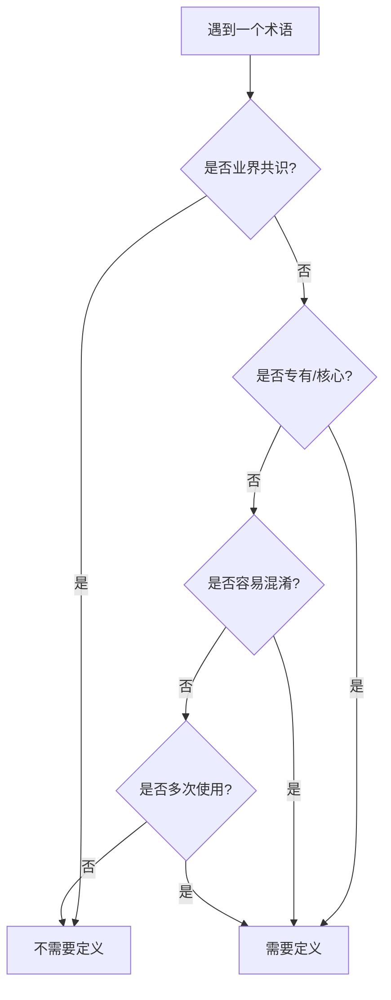

# 术语表撰写规范

## 定义

术语表是典型的 Reference 文档，为特定主题提供术语的精确定义和快速查询。

## 核心原则

### 按主题组织，不按层级

术语表应该**按需创建**，围绕特定主题或领域：
- 内容体系术语表 - 定义文档系统相关概念
- 技术架构术语表 - 定义技术实现相关术语
- 业务领域术语表 - 定义业务概念
- 产品功能术语表 - 定义产品特性

### 灵活定位

- **不限定在特定层级** - 哪里需要就在哪里创建
- **类型固定为 Reference** - 术语表永远是查询导向的
- **可以跨层引用** - Pattern层的术语表可以定义Practice层的概念

## 识别标准

### 哪些术语值得定义

| 类型 | 说明 | 示例 |
|------|------|------|
| **专有概念** | 我们创造或特殊使用的 | DPML、ISSUE方法、矛盾驱动 |
| **容易混淆** | 需要明确区分的相似概念 | 协议 vs 规范 vs 标准 |
| **核心概念** | 理解体系的关键术语 | 四层体系、正交维度、元规范 |
| **特定含义** | 通用词在特定语境的含义 | "模式"(特指Pattern层) |
| **非共识缩写** | 非业界标准的缩写 | DPML（✅）、API（❌） |

### 不需要定义的

- **业界共识** - API、REST、HTTP、JSON等
- **通用概念** - 函数、变量、类等编程概念
- **日常用语** - 普通词汇
- **一次性概念** - 只在特定文档出现一次

### 判断流程



## 结构规范

### 基础模板

```markdown
---
layer: [所在层级]
type: Reference
title: [主题]术语表
---

# [主题]术语表

## 概述
[一句话说明这个术语表的范围和用途]

## 核心术语

### 四层体系
**定义**：Deepractice内容组织的纵向结构
**包含**：Pattern、Protocol、Standards、Products
**作用**：建立从理念到实现的完整链条
**参见**：[理解内容体系](/zh/patterns/content-system/understanding-content-system)

### Diátaxis
**定义**：文档类型分类框架
**包含**：Tutorial、How-to、Explanation、Reference
**作用**：定义文档的写作目的和方式
**来源**：[Diátaxis.fr](https://diataxis.fr)

## 相关术语

### 协议
**定义**：定义交互规则和通信约定的标准
**层级**：Protocol层
**对比**：[规范](#规范)、[标准](#标准)

### 规范
**定义**：定义执行方式和实施细则的标准
**层级**：Practice层
**英文**：Standards/Specification
```

### 必需元素

| 元素 | 说明 | 格式 |
|------|------|------|
| **术语名称** | 作为三级标题 | `### 术语` |
| **定义** | 一句话精确定义 | `**定义**：` |
| **作用** | 为什么需要这个概念 | `**作用**：` |

### 可选元素

| 元素 | 使用场景 | 格式 |
|------|----------|------|
| **包含** | 列举组成部分 | `**包含**：` |
| **对比** | 区分相似概念 | `**对比**：` |
| **示例** | 具体使用案例 | `**示例**：` |
| **参见** | 深入了解链接 | `**参见**：` |
| **来源** | 外部概念出处 | `**来源**：` |
| **层级** | 标注所属层级 | `**层级**：` |
| **英文** | 中英对照 | `**英文**：` |
| **废弃** | 版本变更说明 | `**废弃**：` |

## 组织方式

### 分组原则

1. **核心术语** - 最重要的概念，必须理解的
2. **相关术语** - 扩展概念，深入了解用的
3. **对照表** - 中英对照、新旧对照等

### 排序原则

- **组内按重要性** - 不是按字母序
- **核心概念在前** - 先定义基础概念
- **逻辑关联排序** - 相关概念放在一起

### 索引方式

对于大型术语表（超过20个术语），提供索引：

```markdown
## 快速索引

**按分类**：[核心概念](#核心术语) | [技术术语](#技术术语) | [业务术语](#业务术语)

**按字母**：[A-D](#a-d) | [E-H](#e-h) | [中文](#中文术语)
```

## 撰写要求

### 定义原则

| 原则 | 要求 | 示例 |
|------|------|------|
| **精确性** | 本质特征，不是表象 | ✅ "定义交互规则的标准"<br>❌ "一种文档" |
| **简洁性** | 一句话说清本质 | ✅ "文档类型分类框架"<br>❌ "这是一个..." |
| **独立性** | 用更基础的概念解释 | ✅ "纵向结构"<br>❌ 循环定义 |
| **实用性** | 说明作用和价值 | ✅ 包含"作用"字段<br>❌ 只有定义 |

### 关联处理

```markdown
### 规范
**定义**：定义执行方式的标准
**对比**：
- [协议](#协议) - 定义交互规则
- [标准](#标准) - 两者的统称
**详解**：参见[内容定位规范](./content-positioning-standard)
```

### 示例要求

- 具体可验证
- 来自实际使用
- 不要假设的例子

## 质量标准

### 必须满足

- [ ] 有明确的主题范围
- [ ] 每个术语都有定义和作用
- [ ] 相似概念有对比说明
- [ ] 专有概念标注来源
- [ ] 无循环定义

### 建议包含

- [ ] 实际使用示例
- [ ] 深入了解的链接
- [ ] 中英文对照
- [ ] 概念关系说明

### 必须避免

- [ ] 定义业界共识术语
- [ ] 过度学术化表达
- [ ] 缺少实用价值说明
- [ ] 字母序导致逻辑混乱

## 典型术语表

### 内容体系术语表

```markdown
# 内容体系术语表

## 核心术语

### 四层体系
**定义**：内容组织的纵向结构
**包含**：Pattern、Protocol、Standards、Products
**作用**：建立从理念到实现的递进关系

### Pattern（模式）
**定义**：定义核心理念和设计哲学的层级
**关注**：为什么这样想
**内容**：思想、理念、哲学

### Protocol（协议）  
**定义**：定义交互规则和通信约定的层级
**关注**：如何沟通协作
**内容**：接口、协议、规则

### Practice（实践）
**定义**：定义执行标准和实施细则的层级
**关注**：如何具体执行
**内容**：规范、标准、指南

### Products（产品）
**定义**：具体实现和实例的层级
**关注**：实际怎么用
**内容**：案例、实例、产品
```

## 维护指南

### 新增术语时

1. 判断是否符合识别标准
2. 确定放在哪个主题术语表
3. 写明定义、作用、关联
4. 更新相关术语的对比说明

### 更新术语时

1. 保持定义的稳定性
2. 必要时标注版本变化
3. 更新所有引用
4. 检查对比关系

### 术语演进

```markdown
### Widget
**定义**：可复用的UI组件（v2.0+）
**作用**：提高界面开发效率
**前身**：Component（v1.x，已废弃）
**迁移**：参见[组件迁移指南](/migration)
```

## 文件位置

术语表可以放在任何需要的地方：

```
/patterns/content-system/glossary.md     # Pattern层的内容体系术语
/practice/technical-glossary.md         # Practice层的技术术语
/products/promptx/glossary.md           # 特定产品的术语
/protocols/dpml/glossary.md             # 特定协议的术语
```

原则：**就近原则** - 术语表放在最相关的主题目录下。

## 检查清单

### 创建时

- [ ] 明确术语表的主题范围
- [ ] 识别需要定义的核心术语
- [ ] 建立术语间的关联关系
- [ ] 提供实用价值说明

### 审查时  

- [ ] 是否都是值得定义的术语？
- [ ] 定义是否精确且实用？
- [ ] 是否帮助理解了主题？
- [ ] 关联关系是否清晰？

---

## 参考资源

- [内容定位规范](./content-positioning-standard.md) - 理解文档定位
- [Reference撰写标准](./writing-reference-standard.md) - Reference文档通用规范
- [理解内容体系](/zh/patterns/content-system/understanding-content-system) - 内容体系理念

---

*记住：术语表是为了消除歧义，建立共识，不是为了展示学术水平。*