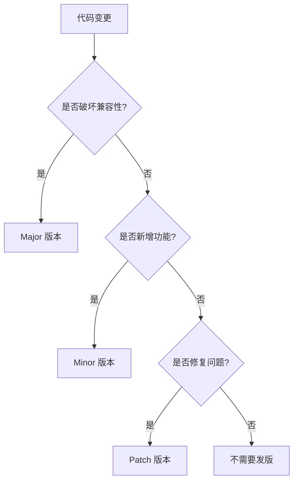

# 版本发布管理指南

## 概述

在 Monorepo 中，版本管理的复杂度随包数量呈指数增长。Changesets 提供了一套完整的版本管理和发布解决方案。

## Changesets 配置

### 安装和初始化

```bash
# 安装 Changesets
pnpm add -D -w @changesets/cli

# 初始化配置
pnpm changeset init
```

### 配置文件详解

```json
// .changeset/config.json
{
  "$schema": "https://unpkg.com/@changesets/config@2.3.1/schema.json",
  "changelog": "@changesets/cli/changelog",
  "commit": false,
  "fixed": [],
  "linked": [],
  "access": "public",
  "baseBranch": "main",
  "updateInternalDependencies": "patch",
  "ignore": ["@org/app-*"],
  "___experimentalUnsafeOptions_WILL_CHANGE_IN_PATCH": {
    "onlyUpdatePeerDependentsWhenOutOfRange": true
  }
}
```

### 配置选项说明

| 选项 | 说明 | 推荐值 |
|------|------|--------|
| `changelog` | 变更日志生成器 | `@changesets/cli/changelog` |
| `commit` | 是否自动提交 | `false`（手动控制） |
| `fixed` | 固定版本的包组 | `[]`（独立版本） |
| `linked` | 联动版本的包组 | 按需配置 |
| `access` | npm 发布权限 | `public` 或 `restricted` |
| `baseBranch` | 基准分支 | `main` |
| `updateInternalDependencies` | 内部依赖更新策略 | `patch` |
| `ignore` | 忽略的包 | 应用类包 |

## 版本策略

### 独立版本模式

每个包独立管理版本：

```json
{
  "fixed": [],
  "linked": []
}
```

适用场景：
- 包功能独立
- 发布周期不同
- 用户独立使用

### 固定版本模式

所有包使用相同版本：

```json
{
  "fixed": [["@org/*"]]
}
```

适用场景：
- 包紧密相关
- 需要版本一致性
- 统一发布周期

### 联动版本模式

相关包版本联动：

```json
{
  "linked": [
    ["@org/ui", "@org/themes"],
    ["@org/core", "@org/utils"]
  ]
}
```

适用场景：
- 部分包相关
- 需要同步更新
- 保持兼容性

## 使用 Changesets

### 创建变更集

```bash
# 交互式创建
pnpm changeset

# 或使用简短命令
pnpm changeset add
```

交互流程：
1. 选择变更的包
2. 选择版本类型（major/minor/patch）
3. 输入变更描述

### 变更集文件

```markdown
---
"@org/ui": minor
"@org/utils": patch
---

feat(ui): 添加新的 Button 组件变体

- 新增 `variant="ghost"` 样式
- 支持自定义图标位置
- 改进无障碍支持
```

### 版本类型选择

| 类型 | 版本变化 | 使用场景 |
|------|---------|----------|
| `major` | 1.0.0 → 2.0.0 | 破坏性变更 |
| `minor` | 1.0.0 → 1.1.0 | 新功能 |
| `patch` | 1.0.0 → 1.0.1 | Bug 修复 |

## 发布流程

### 本地发布流程

```bash
# 1. 创建变更集
pnpm changeset

# 2. 应用版本变更
pnpm changeset version

# 3. 安装依赖（更新锁文件）
pnpm install

# 4. 提交变更
git add .
git commit -m "chore: version packages"

# 5. 发布到 npm
pnpm changeset publish

# 6. 推送标签
git push --follow-tags
```

### 自动化发布（GitHub Actions）

```yaml
# .github/workflows/release.yml
name: Release

on:
  push:
    branches:
      - main

concurrency: ${{ github.workflow }}-${{ github.ref }}

jobs:
  release:
    name: Release
    runs-on: ubuntu-latest
    steps:
      - name: Checkout
        uses: actions/checkout@v4
        with:
          fetch-depth: 0

      - name: Setup pnpm
        uses: pnpm/action-setup@v2
        with:
          version: 8

      - name: Setup Node.js
        uses: actions/setup-node@v4
        with:
          node-version: 20
          cache: 'pnpm'
          registry-url: 'https://registry.npmjs.org'

      - name: Install dependencies
        run: pnpm install --frozen-lockfile

      - name: Build packages
        run: pnpm build

      - name: Create Release Pull Request or Publish
        id: changesets
        uses: changesets/action@v1
        with:
          publish: pnpm changeset publish
          version: pnpm changeset version
          commit: 'chore: version packages'
          title: 'chore: version packages'
        env:
          GITHUB_TOKEN: ${{ secrets.GITHUB_TOKEN }}
          NPM_TOKEN: ${{ secrets.NPM_TOKEN }}

      - name: Publish to npm
        if: steps.changesets.outputs.published == 'true'
        run: |
          echo "Published packages:"
          echo '${{ steps.changesets.outputs.publishedPackages }}'
```

## CHANGELOG 配置

### 基础配置

```json
// .changeset/config.json
{
  "changelog": [
    "@changesets/changelog-github",
    {
      "repo": "org/repo"
    }
  ]
}
```

### 自定义 CHANGELOG 格式

```javascript
// .changeset/changelog-config.js
const getReleaseLine = async (changeset, type) => {
  const [firstLine, ...restLines] = changeset.summary
    .split('\n')
    .map(l => l.trimRight())

  const typeLabel = {
    major: '💥 Breaking',
    minor: '✨ Feature',
    patch: '🐛 Fix'
  }[type] || type

  let line = `- ${typeLabel}: ${firstLine}`
  
  if (changeset.commit) {
    line += ` (${changeset.commit.slice(0, 7)})`
  }

  return line
}

module.exports = {
  getReleaseLine
}
```

### CHANGELOG 示例

```markdown
# @org/ui

## 2.0.0

### Major Changes

- 💥 Breaking: 重构 Button API，移除 deprecated props (a1b2c3d)
- 💥 Breaking: 升级到 React 18 (e4f5g6h)

### Minor Changes

- ✨ Feature: 添加 Tooltip 组件 (i7j8k9l)
- ✨ Feature: Button 支持 loading 状态 (m0n1o2p)

### Patch Changes

- 🐛 Fix: 修复 Button 在 Safari 的样式问题 (q3r4s5t)
- 📦 Update: 更新 @org/utils 到 1.2.3
```

## 预发布版本管理

### 进入预发布模式

```bash
# 进入 beta 预发布
pnpm changeset pre enter beta

# 进入 rc 预发布
pnpm changeset pre enter rc

# 进入 alpha 预发布
pnpm changeset pre enter alpha
```

### 预发布版本发布

```bash
# 创建变更集（同正常流程）
pnpm changeset

# 更新版本（生成预发布版本号）
pnpm changeset version
# 1.0.0 → 1.1.0-beta.0

# 发布预发布版本
pnpm changeset publish --tag beta
```

### 退出预发布模式

```bash
# 退出预发布
pnpm changeset pre exit

# 发布正式版本
pnpm changeset version
pnpm changeset publish
```

## 版本管理策略

### 语义化版本规范

```
主版本号.次版本号.修订号-预发布版本号+构建元数据

1.2.3-beta.4+20230101
│ │ │   │    │     │
│ │ │   │    │     └── 构建元数据
│ │ │   │    └──────── 预发布版本
│ │ │   └───────────── 预发布标签
│ │ └───────────────── 修订号（补丁）
│ └─────────────────── 次版本号（功能）
└───────────────────── 主版本号（破坏性）
```

### 版本升级决策树



### 依赖更新策略

```json
// package.json
{
  "dependencies": {
    // 精确版本（高风险依赖）
    "critical-lib": "1.2.3",
    
    // 补丁更新（稳定依赖）
    "stable-lib": "~2.1.0",
    
    // 兼容更新（常规依赖）
    "normal-lib": "^3.0.0",
    
    // 最新版本（内部包）
    "@org/internal": "workspace:*"
  }
}
```

## 自动化脚本

### 版本管理脚本

```json
// package.json
{
  "scripts": {
    // 变更集管理
    "changeset": "changeset",
    "changeset:add": "changeset add",
    "changeset:status": "changeset status --verbose",
    
    // 版本管理
    "version": "changeset version && pnpm install --no-frozen-lockfile",
    "version:snapshot": "changeset version --snapshot",
    
    // 发布管理
    "release": "pnpm build && changeset publish",
    "release:snapshot": "pnpm build && changeset publish --tag snapshot",
    
    // 预发布管理
    "prerelease:enter": "changeset pre enter",
    "prerelease:exit": "changeset pre exit"
  }
}
```

### 发布前检查

```javascript
// scripts/pre-publish.js
const { execSync } = require('child_process')

// 检查分支
const branch = execSync('git branch --show-current').toString().trim()
if (branch !== 'main') {
  console.error('❌ 只能从 main 分支发布')
  process.exit(1)
}

// 检查工作区
const status = execSync('git status --porcelain').toString()
if (status) {
  console.error('❌ 工作区有未提交的变更')
  process.exit(1)
}

// 运行测试
console.log('🧪 运行测试...')
execSync('pnpm test', { stdio: 'inherit' })

// 构建项目
console.log('📦 构建项目...')
execSync('pnpm build', { stdio: 'inherit' })

console.log('✅ 发布前检查通过')
```

## 故障处理

### 常见问题

#### 问题 1：版本冲突

```bash
# 错误信息
Error: Package "@org/ui" has a dependency on "@org/utils" at version "1.0.0" 
but that version does not exist.

# 解决方案
pnpm changeset version
pnpm install
```

#### 问题 2：发布权限

```bash
# 错误信息
npm ERR! 403 Forbidden - You do not have permission

# 解决方案
npm login
npm access grant read-write org:team @org/package
```

#### 问题 3：标签冲突

```bash
# 错误信息
fatal: tag 'v1.0.0' already exists

# 解决方案
git tag -d v1.0.0
git push origin :refs/tags/v1.0.0
```

### 回滚发布

```bash
# 1. 撤销 npm 发布（24小时内）
npm unpublish @org/package@1.0.0

# 2. 废弃版本（推荐）
npm deprecate @org/package@1.0.0 "版本有问题，请使用 1.0.1"

# 3. 回滚 Git 标签
git tag -d v1.0.0
git push origin :refs/tags/v1.0.0

# 4. 回滚提交
git revert HEAD
git push
```

## 最佳实践

### DO - 推荐做法

✅ **规范的变更集**
- 清晰的变更描述
- 正确的版本类型
- 关联 Issue 或 PR

✅ **自动化流程**
- CI/CD 自动发布
- 自动生成 CHANGELOG
- 自动创建 GitHub Release

✅ **版本策略**
- 遵循语义化版本
- 合理使用预发布
- 保持向后兼容

### DON'T - 避免做法

❌ **手动管理版本**
- 不要手动修改版本号
- 避免直接编辑 CHANGELOG
- 不要跳过变更集

❌ **不规范发布**
- 避免从非主分支发布
- 不要忽略测试失败
- 防止发布未构建的代码

❌ **版本混乱**
- 避免随意的版本号
- 不要忽视破坏性变更
- 防止版本回退

## 集成示例

### 完整的发布配置

```json
// package.json (根目录)
{
  "scripts": {
    "prepare": "husky install",
    "build": "turbo build",
    "test": "turbo test",
    "lint": "turbo lint",
    "changeset": "changeset",
    "version": "changeset version && pnpm install --no-frozen-lockfile",
    "release": "node scripts/pre-publish.js && changeset publish",
    "release:canary": "node scripts/pre-publish.js && changeset publish --tag canary"
  }
}
```

### Husky 集成

```bash
# .husky/pre-push
#!/usr/bin/env sh
. "$(dirname -- "$0")/_/husky.sh"

# 检查是否有未发布的变更集
pnpm changeset status --since=origin/main
```

---

## 参考资源

- [Changesets 文档](https://github.com/changesets/changesets) - 官方文档
- [语义化版本](https://semver.org/lang/zh-CN/) - 版本规范
- [npm 发布文档](https://docs.npmjs.com/cli/v9/commands/npm-publish) - 发布指南
- [Conventional Commits](https://www.conventionalcommits.org/) - 提交规范

---

*记住：版本管理是 Monorepo 的核心挑战之一，自动化和规范化是成功的关键。*