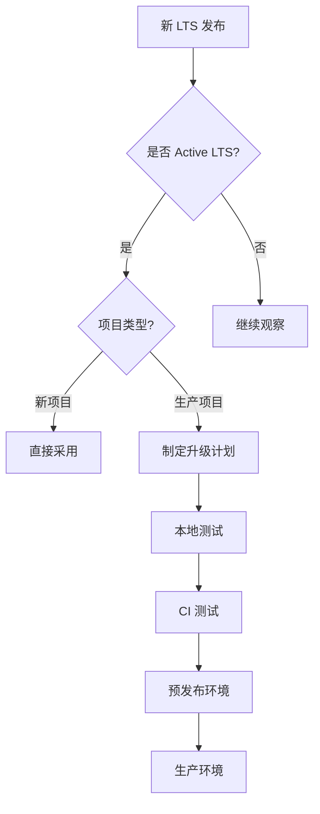

# Node.js 版本管理标准

## 版本选择策略

### 基本原则

| 原则 | 说明 | 理由 |
|------|------|------|
| **LTS 优先** | 始终选择 LTS (Long Term Support) 版本 | 稳定性和长期支持 |
| **偶数版本** | 只使用偶数版本号（如 18.x, 20.x） | 偶数是 LTS，奇数是实验版 |
| **活跃 LTS** | 优先选择 Active LTS 而非 Maintenance LTS | 获得新特性和性能优化 |
| **统一版本** | 开发、测试、生产使用相同主版本 | 避免环境差异 |

### 版本选择矩阵

| 项目类型 | 推荐版本 | 最低版本 | 说明 |
|----------|----------|----------|------|
| **生产项目** | Node.js 20.x LTS | 18.x LTS | 使用最新 Active LTS |
| **新项目** | Node.js 20.x LTS | 20.x LTS | 直接采用最新 LTS |
| **维护项目** | 项目创建时的 LTS | 16.x LTS | 谨慎升级，充分测试 |
| **实验项目** | Node.js 22.x | 20.x LTS | 可尝试新特性 |

### 版本生命周期

```
Node.js 版本发布周期：
- 每年 4 月：发布新的 LTS 版本（偶数）
- 每年 10 月：新 LTS 进入 Active 阶段
- Active LTS：18 个月活跃支持
- Maintenance LTS：12 个月维护支持
- EOL：停止支持

当前状态 (2025-01)：
- 20.x：Active LTS (推荐)
- 18.x：Maintenance LTS
- 16.x：EOL (应该升级)
```

## 版本管理工具

### 工具选择

| 平台 | 首选工具 | 备选工具 | 理由 |
|------|----------|----------|------|
| **macOS** | [fnm](https://github.com/Schniz/fnm) | [nvm](https://github.com/nvm-sh/nvm) | fnm 更快，Rust 编写 |
| **Linux** | [fnm](https://github.com/Schniz/fnm) | [nvm](https://github.com/nvm-sh/nvm) | 跨平台一致性 |
| **Windows** | [fnm](https://github.com/Schniz/fnm) | [nvm-windows](https://github.com/coreybutler/nvm-windows) | 原生 Windows 支持 |

### fnm 安装配置

```bash
# macOS/Linux (使用 Homebrew)
brew install fnm

# 配置 shell (添加到 ~/.zshrc 或 ~/.bashrc)
eval "$(fnm env --use-on-cd)"

# Windows (使用 Scoop)
scoop install fnm

# 配置 PowerShell
fnm env --use-on-cd | Out-String | Invoke-Expression
```

### fnm 使用规范

```bash
# 安装 Node.js 版本
fnm install 20.11.0
fnm install --lts  # 安装最新 LTS

# 使用特定版本
fnm use 20.11.0
fnm use --lts

# 设置默认版本
fnm default 20.11.0

# 列出已安装版本
fnm list

# 列出可用版本
fnm list-remote
```

## 版本锁定机制

### 项目级版本锁定

每个项目根目录必须包含版本文件：

```bash
# .nvmrc (nvm 格式，fnm 也支持)
20.11.0

# 或 .node-version (fnm 原生格式)
20.11.0
```

### package.json 引擎约束

```json
{
  "engines": {
    "node": ">=20.11.0 <21.0.0",
    "npm": ">=10.0.0",
    "pnpm": ">=8.0.0"
  }
}
```

### CI/CD 版本验证

```yaml
# GitHub Actions 示例
- uses: actions/setup-node@v4
  with:
    node-version-file: '.nvmrc'
    
# 或直接指定
- uses: actions/setup-node@v4
  with:
    node-version: '20.11.0'
```

## 版本升级流程

### 升级决策树



### 升级步骤

1. **评估阶段**
   - 查看 Node.js 变更日志
   - 评估破坏性变更影响
   - 确认依赖包兼容性

2. **测试阶段**
   ```bash
   # 本地测试
   fnm install 20.11.0
   fnm use 20.11.0
   npm test
   npm run build
   ```

3. **渐进部署**
   - 开发环境 → 测试环境 → 预发布 → 生产
   - 每个阶段观察至少 1 周

4. **更新文档**
   - 更新 .nvmrc
   - 更新 package.json engines
   - 更新 CI/CD 配置
   - 通知团队成员

## 多版本共存

### 场景支持

| 场景 | 解决方案 | 示例 |
|------|----------|------|
| **多项目不同版本** | fnm 自动切换 | 配置 `--use-on-cd` |
| **全局工具冲突** | 使用项目局部安装 | npx 或 pnpm exec |
| **临时测试** | fnm shell 命令 | `fnm exec --using=18 npm test` |

### 配置示例

```bash
# 项目 A (.nvmrc)
18.19.0

# 项目 B (.nvmrc)
20.11.0

# 自动切换（已配置 --use-on-cd）
cd project-a  # 自动切换到 18.19.0
cd project-b  # 自动切换到 20.11.0
```

## 故障排除

### 常见问题

| 问题 | 原因 | 解决方案 |
|------|------|----------|
| **command not found: node** | 未安装或未配置 PATH | 重新运行 `fnm env` |
| **版本切换失败** | .nvmrc 格式错误 | 检查文件内容，只包含版本号 |
| **全局包丢失** | 切换版本后全局包不共享 | 每个版本需单独安装或使用 npx |
| **permission denied** | npm 全局目录权限问题 | 使用 fnm 管理，避免 sudo |

### 诊断命令

```bash
# 检查当前版本
node --version
which node

# 检查 fnm 状态
fnm current
fnm list

# 检查环境变量
echo $PATH | grep fnm
echo $FNM_DIR

# 验证项目配置
cat .nvmrc
cat package.json | grep engines
```

## 最佳实践

### DO ✅

- 始终在项目中包含 .nvmrc
- 定期更新到最新的安全补丁版本
- 在 CI/CD 中强制版本检查
- 使用 engines 字段约束版本范围
- 文档记录版本要求

### DON'T ❌

- 不要使用奇数版本用于生产
- 不要跳过主版本升级（如 16 直接到 20）
- 不要在生产环境使用 Current 版本
- 不要忽略版本废弃警告
- 不要使用 sudo 安装 Node.js

## 迁移指南

### 从系统包管理器迁移

```bash
# 1. 卸载系统 Node.js
# macOS
brew uninstall node

# Ubuntu/Debian
sudo apt remove nodejs

# 2. 安装 fnm
brew install fnm

# 3. 配置 shell
echo 'eval "$(fnm env --use-on-cd)"' >> ~/.zshrc

# 4. 安装 Node.js
fnm install --lts
fnm default $(fnm current)
```

### 从 nvm 迁移

```bash
# 1. 列出 nvm 版本
nvm list

# 2. 安装相同版本到 fnm
fnm install 20.11.0
fnm install 18.19.0

# 3. 迁移全局包（如需要）
npm list -g --depth=0

# 4. 可选：卸载 nvm
# 删除 nvm 相关配置从 shell rc 文件
```

## 审计与合规

### 版本审计清单

- [ ] 所有项目都有 .nvmrc 文件
- [ ] 生产项目使用 LTS 版本
- [ ] 没有使用 EOL 版本
- [ ] CI/CD 版本与本地一致
- [ ] package.json 有 engines 约束

### 定期检查

每季度执行：
1. 检查 Node.js 安全公告
2. 评估版本升级需求
3. 更新版本管理工具
4. 审查项目版本分布

---

## 参考资源

- [Node.js Release Schedule](https://nodejs.org/en/about/releases/)
- [fnm Documentation](https://github.com/Schniz/fnm)
- [Node.js Security Releases](https://nodejs.org/en/blog/vulnerability/)

---

*记住：版本一致性是团队协作的基础。*