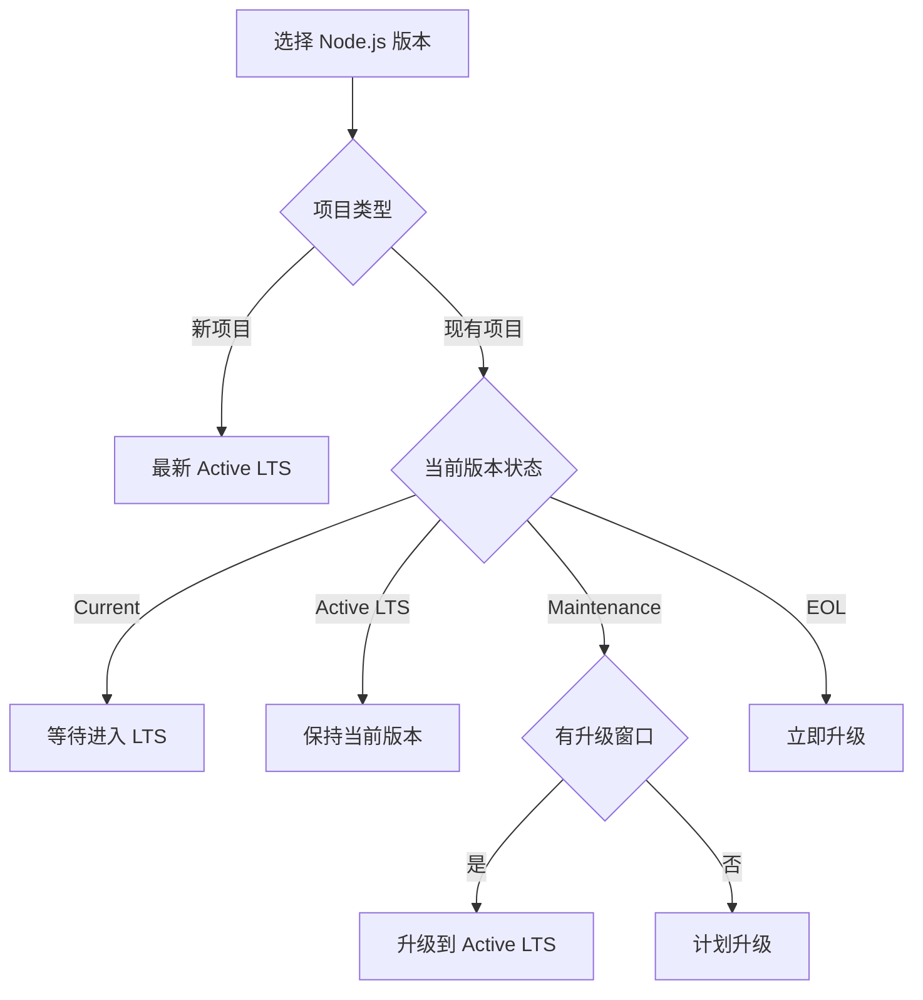

# Node.js 版本管理标准

## 版本策略

### LTS 版本生命周期

| 阶段 | 时长 | 说明 | 适用场景 |
|------|------|------|----------|
| **Current** | 6 个月 | 最新特性，快速迭代 | 实验项目、技术预研 |
| **Active LTS** | 18 个月 | 功能稳定，积极维护 | 新项目、生产环境 |
| **Maintenance LTS** | 12 个月 | 仅修复严重问题 | 遗留项目、稳定系统 |
| **End of Life** | - | 停止支持 | 必须升级 |

### 版本选择决策树



### 2025 年版本规划

| 版本 | 状态 | 开始日期 | 结束日期 | 推荐度 |
|------|------|----------|----------|--------|
| **Node.js 18.x** | Maintenance LTS | 2023-10 | 2025-04 | ⭐⭐⭐ |
| **Node.js 20.x** | Active LTS | 2024-10 | 2026-04 | ⭐⭐⭐⭐⭐ |
| **Node.js 22.x** | Current | 2024-04 | 2024-10 | ⭐⭐ |

## 版本管理工具标准

### fnm 配置规范

**安装脚本**：
```bash
#!/bin/bash
# install-fnm.sh

# 检测操作系统
if [[ "$OSTYPE" == "darwin"* ]]; then
    # macOS
    brew install fnm
elif [[ "$OSTYPE" == "linux-gnu"* ]]; then
    # Linux
    curl -fsSL https://fnm.vercel.app/install | bash
elif [[ "$OSTYPE" == "msys" ]] || [[ "$OSTYPE" == "cygwin" ]]; then
    # Windows
    winget install Schniz.fnm
fi

# 配置 shell（以 zsh 为例）
echo 'eval "$(fnm env --use-on-cd)"' >> ~/.zshrc
source ~/.zshrc
```

**配置文件**（~/.fnm/fnm.toml）：
```toml
# fnm 全局配置
node-dist-mirror = "https://nodejs.org/dist"
default-version = "20"
corepack-enabled = true
resolve-node-version = "recursive"
```

### 项目版本文件

每个项目必须包含：

1. **.nvmrc**（版本声明）
```
20.11.0
```

2. **package.json**（版本约束）
```json
{
  "engines": {
    "node": ">=20.11.0 <21.0.0",
    "npm": ">=10.0.0"
  }
}
```

3. **.npmrc**（强制版本检查）
```ini
engine-strict=true
```

## 版本升级流程

### 升级前评估

| 检查项 | 工具/命令 | 通过标准 |
|--------|-----------|-----------|
| **依赖兼容性** | `npm ls` | 无错误 |
| **引擎要求** | `npm audit` | 所有依赖支持新版本 |
| **废弃 API** | `node --pending-deprecation` | 无废弃警告 |
| **性能基准** | 项目性能测试 | 性能不下降 |

### 升级步骤

```bash
# 1. 安装新版本（不切换）
fnm install 20.11.0

# 2. 在测试分支测试
git checkout -b upgrade/node-20
fnm use 20.11.0

# 3. 更新配置文件
echo "20.11.0" > .nvmrc
# 更新 package.json 的 engines 字段

# 4. 清理并重装依赖
rm -rf node_modules package-lock.json
npm install

# 5. 运行测试
npm test
npm run build

# 6. 性能测试
npm run benchmark

# 7. 提交更改
git add .
git commit -m "chore: upgrade Node.js to 20.11.0"
```

### 回滚方案

```bash
# 快速回滚
fnm use 18.19.0
rm -rf node_modules
npm install

# 从 Git 恢复
git checkout main -- .nvmrc package.json package-lock.json
npm ci
```

## 多版本共存

### 项目隔离

```bash
# 项目 A（Node.js 18）
cd ~/projects/project-a
fnm use # 自动切换到 .nvmrc 指定版本

# 项目 B（Node.js 20）
cd ~/projects/project-b
fnm use # 自动切换到 .nvmrc 指定版本
```

### 全局工具管理

```bash
# 为特定版本安装全局工具
fnm exec --using=20 npm install -g pnpm
fnm exec --using=18 npm install -g yarn

# 使用特定版本运行命令
fnm exec --using=20 pnpm install
```

## 版本验证

### 自动化检查

**pre-commit hook**：
```bash
#!/bin/bash
# .git/hooks/pre-commit

# 检查 Node.js 版本
REQUIRED_NODE=$(cat .nvmrc)
CURRENT_NODE=$(node -v | sed 's/v//')

if [[ "$CURRENT_NODE" != "$REQUIRED_NODE"* ]]; then
    echo "❌ Node.js 版本不匹配"
    echo "   需要: $REQUIRED_NODE"
    echo "   当前: $CURRENT_NODE"
    echo "   运行: fnm use"
    exit 1
fi
```

**CI 验证**：
```yaml
# .github/workflows/check.yml
- name: Setup Node.js
  uses: actions/setup-node@v4
  with:
    node-version-file: '.nvmrc'
    
- name: Verify Node.js version
  run: |
    node -v
    npm -v
```

## 特殊场景

### Monorepo 版本管理

```json
// 根 package.json
{
  "engines": {
    "node": ">=20.11.0"
  },
  "workspaces": ["packages/*"]
}

// 子包可以有更严格的要求
// packages/cli/package.json
{
  "engines": {
    "node": ">=20.11.0 <20.12.0"
  }
}
```

### 渐进式升级

对于大型项目，采用渐进式升级：

1. **Phase 1**: 开发环境升级
2. **Phase 2**: 测试环境升级
3. **Phase 3**: 预发布环境升级
4. **Phase 4**: 生产环境灰度升级
5. **Phase 5**: 全量升级

## 监控和告警

### 版本状态监控

```javascript
// scripts/check-node-status.js
const https = require('https');

function checkNodeLTSStatus() {
  https.get('https://nodejs.org/dist/index.json', (res) => {
    let data = '';
    res.on('data', chunk => data += chunk);
    res.on('end', () => {
      const versions = JSON.parse(data);
      const currentVersion = process.version;
      const versionInfo = versions.find(v => v.version === currentVersion);
      
      if (!versionInfo) {
        console.warn('⚠️ 使用的 Node.js 版本不在官方列表中');
      } else if (!versionInfo.lts) {
        console.warn('⚠️ 当前版本不是 LTS 版本');
      } else {
        console.log(`✅ 使用 LTS 版本: ${versionInfo.lts}`);
      }
    });
  });
}

checkNodeLTSStatus();
```

## 最佳实践总结

### ✅ 推荐做法

1. **始终使用 LTS** - 生产环境只用 Active LTS
2. **版本文件三件套** - .nvmrc + engines + engine-strict
3. **自动切换版本** - fnm 的 use-on-cd 功能
4. **定期升级计划** - 每 6 个月评估一次

### ❌ 避免做法

1. **跳过大版本** - 不要从 16 直接跳到 20
2. **忽略废弃警告** - 及时处理 deprecation warnings
3. **生产用 Current** - Current 版本仅用于实验
4. **延迟 EOL 升级** - EOL 前至少 3 个月开始升级

## 故障排查

### 常见问题

| 问题 | 原因 | 解决方案 |
|------|------|----------|
| 版本切换失败 | Shell 配置不正确 | 重新配置 fnm env |
| 全局包丢失 | 版本切换后路径变化 | 为每个版本重装 |
| 性能下降 | V8 引擎变化 | 调整 --max-old-space-size |
| 原生模块报错 | ABI 不兼容 | 重新编译 node_modules |

---

*记住：版本管理不是限制，而是为了更好的稳定性和可维护性。*