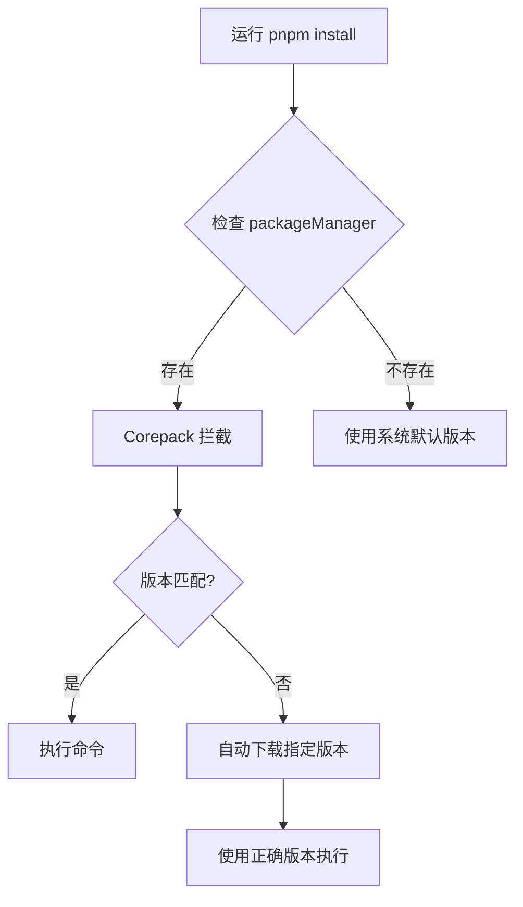

# packageManager 字段规范

## 概述

`packageManager` 字段是 Node.js 16.13+ 引入的标准字段，用于声明项目使用的包管理器及其精确版本。配合 Corepack 工具，可以实现包管理器的自动安装和版本管理。

## 字段定义

### 语法格式

```json
{
  "packageManager": "<包管理器名称>@<精确版本号>"
}
```

### 支持的包管理器

| 包管理器 | 示例值 | 最低 Node.js 版本 |
|----------|--------|-------------------|
| **pnpm** | `pnpm@8.15.0` | 16.13.0 |
| **yarn** | `yarn@3.6.4` | 16.13.0 |
| **npm** | `npm@10.2.4` | 16.13.0 |

### 配置示例

```json
{
  "name": "my-project",
  "version": "1.0.0",
  "packageManager": "pnpm@8.15.0",
  "engines": {
    "node": ">=20.0.0"
  }
}
```

## Corepack 使用

### 启用 Corepack

```bash
# Node.js 16.13-19.x 需要手动启用
corepack enable

# Node.js 20+ 默认启用
# 验证状态
corepack --version
```

### 工作原理



### 自动安装

```bash
# 项目声明了 pnpm@8.15.0
# 但系统只有 pnpm@7.0.0

# 运行任何 pnpm 命令
pnpm install

# Corepack 自动：
# 1. 检测到版本不匹配
# 2. 下载 pnpm@8.15.0
# 3. 使用 8.15.0 执行命令
```

## 版本锁定策略

### 精确版本（推荐）

```json
{
  "packageManager": "pnpm@8.15.0"
}
```

**优点**：
- ✅ 完全一致的版本
- ✅ 避免意外升级
- ✅ CI/CD 稳定性

**使用场景**：
- 生产项目
- 团队协作
- CI/CD 环境

### 版本范围（不推荐）

```json
{
  // ❌ 不支持范围版本
  "packageManager": "pnpm@^8.0.0"
}
```

**注意**：packageManager 字段**只支持精确版本**。

## 配置最佳实践

### 基础配置

```json
{
  "name": "monorepo-project",
  "version": "1.0.0",
  "private": true,
  "packageManager": "pnpm@8.15.0",
  "engines": {
    "node": ">=20.0.0",
    "pnpm": ">=8.15.0"
  },
  "scripts": {
    "preinstall": "npx only-allow pnpm",
    "prepare": "husky install"
  }
}
```

### 强制使用指定包管理器

```json
{
  "scripts": {
    "preinstall": "npx only-allow pnpm"
  }
}
```

或使用自定义脚本：

```javascript
// scripts/check-package-manager.js
const agent = process.env.npm_config_user_agent;
const pm = agent?.split('/')[0];

if (pm !== 'pnpm') {
  console.error('\n❌ 错误：此项目必须使用 pnpm\n');
  console.log('请运行: npm install -g pnpm');
  console.log('然后: pnpm install\n');
  process.exit(1);
}
```

## 更新流程

### 更新包管理器版本

```bash
# 1. 查看最新版本
npm view pnpm version

# 2. 更新 package.json
{
  "packageManager": "pnpm@8.15.1"  // 更新版本号
}

# 3. 清理缓存（可选）
corepack cache clean

# 4. 测试新版本
pnpm --version  # 应该显示 8.15.1
```

### 版本回滚

```bash
# 恢复到旧版本
{
  "packageManager": "pnpm@8.14.0"
}

# Corepack 会自动使用指定版本
pnpm install
```

## CI/CD 配置

### GitHub Actions

```yaml
name: CI
on: [push, pull_request]

jobs:
  test:
    runs-on: ubuntu-latest
    steps:
      - uses: actions/checkout@v4
      
      - name: Setup Node.js
        uses: actions/setup-node@v4
        with:
          node-version-file: '.nvmrc'
      
      # Corepack 会自动处理包管理器
      - name: Enable Corepack
        run: corepack enable
      
      - name: Install dependencies
        run: pnpm install --frozen-lockfile
```

### GitLab CI

```yaml
image: node:20

before_script:
  - corepack enable
  - pnpm --version  # 会自动使用 packageManager 指定的版本

test:
  script:
    - pnpm install --frozen-lockfile
    - pnpm test
```

### Docker

```dockerfile
FROM node:20-alpine

# 启用 Corepack
RUN corepack enable

WORKDIR /app

# 复制 package.json（包含 packageManager 字段）
COPY package.json pnpm-lock.yaml ./

# Corepack 会自动使用正确版本
RUN pnpm install --frozen-lockfile

COPY . .
RUN pnpm build

CMD ["pnpm", "start"]
```

## 团队协作

### 新成员入职

```bash
# 1. 克隆项目
git clone <repo>
cd <project>

# 2. 安装 Node.js（使用 fnm）
fnm use

# 3. 启用 Corepack
corepack enable

# 4. 安装依赖（自动使用正确的包管理器版本）
pnpm install  # 即使本地没有 pnpm，Corepack 会自动安装
```

### 版本同步检查

```javascript
// scripts/check-versions.js
const fs = require('fs');
const pkg = JSON.parse(fs.readFileSync('package.json', 'utf8'));

// 检查 packageManager
if (!pkg.packageManager) {
  console.error('❌ 缺少 packageManager 字段');
  process.exit(1);
}

// 检查版本格式
const [pm, version] = pkg.packageManager.split('@');
if (!version || version.includes('^') || version.includes('~')) {
  console.error('❌ packageManager 必须使用精确版本');
  process.exit(1);
}

console.log(`✅ 使用 ${pm}@${version}`);
```

## 故障排查

### 常见问题

| 问题 | 原因 | 解决方案 |
|------|------|----------|
| Corepack 未找到 | Node.js 版本过低 | 升级到 16.13+ |
| 版本不匹配警告 | 本地版本与声明不一致 | 运行 `corepack enable` |
| 下载失败 | 网络问题 | 配置代理或镜像 |
| 权限错误 | 全局安装位置 | 使用 `sudo corepack enable` |

### 调试命令

```bash
# 查看 Corepack 版本
corepack --version

# 查看缓存的包管理器
corepack cache list

# 清理缓存
corepack cache clean

# 手动准备包管理器
corepack prepare pnpm@8.15.0 --activate

# 禁用 Corepack（如需要）
corepack disable
```

### 环境变量

```bash
# 跳过 Corepack（紧急情况）
COREPACK_ENABLE_STRICT=0 pnpm install

# 使用镜像（中国用户）
COREPACK_NPM_REGISTRY=https://registry.npmmirror.com
```

## 迁移指南

### 添加 packageManager 字段

```bash
# 1. 确定当前使用的包管理器版本
pnpm --version  # 8.15.0

# 2. 添加到 package.json
{
  "packageManager": "pnpm@8.15.0"
}

# 3. 启用 Corepack
corepack enable

# 4. 测试
rm -rf node_modules
pnpm install
```

### 从 .nvmrc 迁移

```json
// 之前：分散管理
// .nvmrc: 20.11.0
// README: "使用 pnpm 8.x"

// 之后：集中管理
{
  "engines": {
    "node": ">=20.11.0"
  },
  "packageManager": "pnpm@8.15.0"
}
```

## 最佳实践总结

### ✅ 推荐做法

1. **始终使用精确版本**
2. **配合 engines 字段使用**
3. **在 CI/CD 中启用 Corepack**
4. **定期更新但要测试**

### ❌ 避免做法

1. **使用版本范围** - packageManager 不支持
2. **忽略版本不匹配** - 会导致构建问题
3. **手动管理版本** - 让 Corepack 自动处理
4. **混用包管理器** - 坚持使用声明的包管理器

---

*记住：packageManager 字段是确保团队使用相同包管理器版本的最简单方法。*