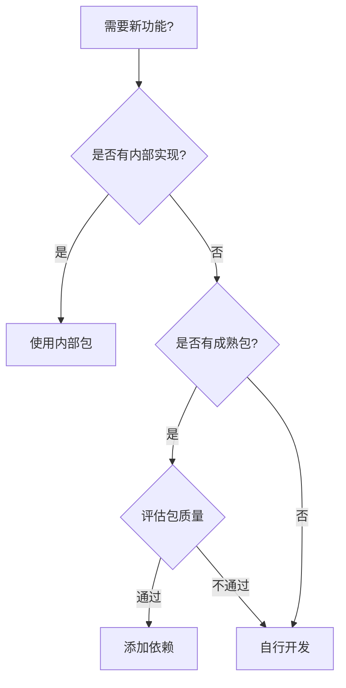

# 包管理策略

## 概述

本目录定义了 Deepractice 组织内包依赖管理的完整策略，从选择、安装到维护的全生命周期管理规范。

## 核心原则

- **最小依赖**：只安装必需的包
- **版本锁定**：使用 lockfile 确保一致性
- **定期更新**：平衡稳定性和安全性
- **安全优先**：定期审计和修复漏洞
- **统一管理**：团队使用相同的包管理器

## 目录结构

```
package-management/
├── index.md                           # 本文件
├── dependency-selection-standard.md   # 依赖选择标准（待创建）
├── version-strategy-standard.md       # 版本策略标准（待创建）
├── security-audit-standard.md         # 安全审计标准（待创建）
├── private-package-standard.md        # 私有包管理标准（待创建）
└── how-to-manage-dependencies.md      # 如何管理依赖（待创建）
```

## 核心文档

### 管理标准
- 依赖选择标准 `Reference` - 待创建
- 版本策略标准 `Reference` - 待创建
- 安全审计标准 `Reference` - 待创建

### 操作指南
- 如何管理依赖 `How-to` - 待创建
- 私有包管理标准 `Reference` - 待创建

## 快速指南

### 依赖选择决策树



### 包质量评估标准

| 维度 | 权重 | 评估标准 |
|------|------|----------|
| **维护活跃度** | 30% | 最近更新时间、Issue 响应速度 |
| **下载量** | 20% | npm 周下载量、使用趋势 |
| **安全性** | 25% | 已知漏洞、依赖深度 |
| **文档质量** | 15% | README、API 文档、示例 |
| **许可证** | 10% | 开源协议兼容性 |

### 版本策略

```json
{
  "dependencies": {
    "express": "^4.18.0",      // 生产依赖：次版本兼容
    "lodash": "4.17.21",       // 工具库：精确版本
    "react": "^18.0.0"         // 框架：主版本兼容
  },
  "devDependencies": {
    "typescript": "^5.0.0",    // 开发工具：次版本兼容
    "eslint": "^8.0.0",        // 代码质量：次版本兼容
    "@types/node": "*"         // 类型定义：最新版本
  }
}
```

## 依赖管理流程

### 1. 添加新依赖

```bash
# 评估必要性
npm view <package> # 查看包信息

# 检查安全性
npm audit <package>

# 安装依赖
pnpm add <package> # 生产依赖
pnpm add -D <package> # 开发依赖
```

### 2. 更新依赖

```bash
# 检查过时包
pnpm outdated

# 交互式更新
pnpm update --interactive

# 更新特定包
pnpm update <package>
```

### 3. 安全审计

```bash
# 运行审计
pnpm audit

# 自动修复
pnpm audit --fix

# 查看详情
pnpm audit --json
```

## 最佳实践

### DO ✅

- 定期更新依赖（每月）
- 使用 lockfile 锁定版本
- 区分生产和开发依赖
- 评估包的必要性和质量
- 及时修复安全漏洞

### DON'T ❌

- 不要忽略安全警告
- 不要使用废弃的包
- 不要过度依赖外部包
- 不要在生产环境安装开发依赖
- 不要使用不明来源的包

## 常见场景

### Monorepo 依赖管理

- 使用 workspace 协议
- 共享依赖提升到根目录
- 版本同步策略
- 依赖隔离原则

### 私有包管理

- 发布到私有 Registry
- 访问权限控制
- 版本发布流程
- 文档和更新通知

### 依赖冲突解决

- 使用 resolutions/overrides
- 评估兼容性影响
- 寻找替代方案
- 向上游反馈问题

## 工具推荐

| 工具 | 用途 | 使用场景 |
|------|------|----------|
| **npm-check-updates** | 依赖更新 | 批量更新检查 |
| **depcheck** | 无用依赖检测 | 清理项目 |
| **npm-audit-resolver** | 审计解决 | 处理安全问题 |
| **license-checker** | 许可证检查 | 合规性验证 |

## 相关资源

### 上层规范
- [Node.js 开发环境规范](../index.md) - 整体开发环境标准
- [npm/pnpm 配置标准](../nodejs/npm-configuration-standard.md) - 包管理器配置

### 外部资源
- [npm Best Practices](https://docs.npmjs.com/misc/developers)
- [Dependency Management Best Practices](https://github.com/goldbergyoni/nodebestpractices#5-dependencies)
- [Snyk Vulnerability Database](https://snyk.io/vuln)

---

*记住：好的依赖管理是项目稳定性的基础。*