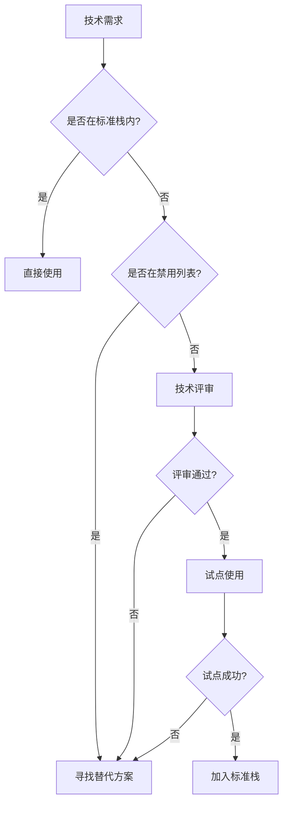

# 技术栈选择标准

## 核心技术栈

### 强制标准（必须使用）

| 类别 | 技术选择 | 版本要求 | 理由 |
|------|---------|----------|------|
| **运行时** | Node.js | >=20.0.0 | LTS 版本，原生 ESM 支持 |
| **语言** | TypeScript | >=5.0.0 | 类型安全，生态成熟 |
| **包管理器** | pnpm | >=8.0.0 | 性能最优，磁盘效率高 |
| **模块系统** | ESM | - | 现代标准，tree-shaking |
| **代码检查** | ESLint | >=8.0.0 | 行业标准，插件丰富 |
| **代码格式化** | Prettier | >=3.0.0 | 零配置，一致性强 |
| **版本控制** | Git | >=2.0.0 | 行业标准 |

### 推荐标准（优先选择）

| 类别 | 技术选择 | 适用场景 | 备选方案 |
|------|---------|----------|----------|
| **测试框架** | Vitest | 单元测试、集成测试 | Jest（遗留项目） |
| **构建工具** | Vite | Web 应用、库构建 | esbuild、tsup |
| **Monorepo** | Turborepo | 多包项目 | Nx、Lerna |
| **Git Hooks** | Lefthook | 快速、并行执行、单文件配置 | Husky（复杂） |
| **提交规范** | Commitlint | 提交消息验证 | - |
| **版本管理** | Changesets | Monorepo 版本发布 | - |

## 版本策略

### Node.js 版本

```javascript
// .nvmrc
20.11.0  // 当前 LTS

// package.json
"engines": {
  "node": ">=20.0.0"
}
```

**升级原则**：
- 始终使用 Active LTS 版本
- 新项目使用最新 LTS
- 现有项目每年升级一次
- 不使用奇数版本（非 LTS）

### TypeScript 版本

```javascript
// package.json
"devDependencies": {
  "typescript": "^5.3.0"  // 允许小版本更新
}
```

**升级原则**：
- 紧跟最新稳定版
- 季度评估升级
- 注意 breaking changes

## 框架选择标准

### 后端框架

| 用途 | 首选 | 理由 | 禁用 |
|------|------|------|------|
| API 服务 | NestJS | 企业级、模块化、装饰器模式 | Express（缺少结构） |
| GraphQL | NestJS + GraphQL | 集成完善、类型安全 | - |
| 微服务 | NestJS | 微服务原生支持 | - |
| CLI 工具 | Commander.js | 简单易用、文档完善 | - |

### 前端框架（Node.js 工具链）

| 用途 | 首选 | 理由 | 禁用 |
|------|------|------|------|
| React 构建 | Vite | 快速、ESM 原生 | Create React App |
| Vue 构建 | Vite | 官方推荐 | Vue CLI |
| SSR/SSG | Next.js/Nuxt | 生态成熟 | - |

## 依赖选择原则

### 必须满足的条件

- [ ] **活跃维护** - 最近 6 个月有更新
- [ ] **许可证兼容** - MIT、Apache 2.0、BSD
- [ ] **安全性** - 无已知高危漏洞
- [ ] **类型支持** - 原生 TypeScript 或有 @types
- [ ] **文档完善** - 有清晰的 API 文档
- [ ] **社区活跃** - GitHub stars > 100

### 评估矩阵

| 评估维度 | 权重 | 及格线 |
|---------|------|--------|
| 维护活跃度 | 30% | 月度更新 |
| 性能表现 | 25% | 基准测试前 50% |
| 社区生态 | 20% | npm 周下载 > 10k |
| 文档质量 | 15% | API 文档完整 |
| 类型支持 | 10% | TypeScript 原生 |

## 禁用技术清单

### 明确禁用

| 技术 | 禁用原因 | 替代方案 |
|------|----------|----------|
| **npm/yarn** | 性能差、磁盘占用大 | pnpm |
| **CommonJS** | 过时、无 tree-shaking | ESM |
| **Callback** | 回调地狱、难维护 | Promise/Async |
| **TSLint** | 已废弃 | ESLint |
| **Moment.js** | 体积大、不支持 tree-shaking | date-fns、dayjs |
| **Request** | 已废弃 | fetch、axios |
| **Node < 20** | 缺少现代特性 | Node.js 20+ |

### 谨慎使用

| 技术 | 使用限制 | 注意事项 |
|------|----------|----------|
| **装饰器** | 仅 NestJS 项目 | 实验性特性 |
| **Webpack** | 仅特殊需求 | 优先用 Vite |
| **Babel** | 仅必要时 | TypeScript 够用 |
| **ORM** | 评估必要性 | 考虑 SQL builder |
| **Husky** | 避免使用 | 用 Lefthook 替代 |

## 关键技术选择理由

### 为什么选择 Lefthook 而不是 Husky

| 对比维度 | Lefthook | Husky |
|---------|----------|-------|
| **性能** | 并行执行，更快 | 串行执行，较慢 |
| **配置** | 单个 YAML 文件 | 多个 shell 脚本 |
| **依赖** | Go 二进制，轻量 | Node.js 依赖 |
| **灵活性** | 内置 glob、并行、条件执行 | 需要额外工具 |
| **维护** | 配置集中，易维护 | 分散脚本，难管理 |

## 技术债务管理

### 遗留项目处理

1. **逐步迁移** - 不强制立即重写
2. **新功能新标准** - 新增部分使用新技术栈
3. **关键路径优先** - 核心模块优先升级
4. **设置过渡期** - 给出明确的迁移时间表

### 技术评审机制

- 新技术引入需要技术评审
- 评审内容：必要性、风险、成本
- 决策记录：ADR（Architecture Decision Records）
- 试点项目：新技术先在小项目试点

## 项目类型技术栈

### CLI 工具

```json
{
  "基础": "Node.js + TypeScript + ESM",
  "框架": "Commander.js",
  "打包": "tsup",
  "测试": "Vitest"
}
```

### API 服务

```json
{
  "基础": "Node.js + TypeScript + ESM",
  "框架": "NestJS",
  "验证": "class-validator + class-transformer",
  "数据库": "TypeORM / Prisma",
  "文档": "Swagger (内置)",
  "测试": "Jest (内置) + Supertest"
}
```

### Monorepo 项目

```json
{
  "基础": "Node.js + TypeScript + ESM",
  "管理": "pnpm workspace + Turborepo",
  "版本": "Changesets",
  "构建": "Vite / tsup",
  "质量": "ESLint + Prettier + Lefthook"
}
```

### Electron 客户端

```json
{
  "基础": "Node.js + TypeScript",
  "框架": "Electron + Vite",
  "UI框架": "React / Vue",
  "状态管理": "Zustand / Pinia",
  "样式": "Tailwind CSS",
  "进程通信": "Electron IPC + tRPC",
  "打包": "electron-builder"
}
```

## 决策流程



## 合规检查清单

项目启动前必须确认：

- [ ] Node.js 版本 >= 20.0.0
- [ ] 使用 pnpm 作为包管理器
- [ ] 配置 TypeScript 5+
- [ ] 使用 ESM 模块系统
- [ ] 配置 ESLint + Prettier
- [ ] 设置 Git hooks
- [ ] 所有依赖符合选择原则
- [ ] 无禁用技术的使用

---

*提示：技术选型影响项目长期维护，请严格遵守标准。*
