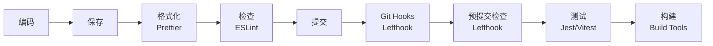

# 工具链集成

## 概述

本目录定义了 Node.js 开发中各类工具的集成标准，构建从编码到提交的完整质量保障体系。

## 核心理念

- **自动化优先**：能自动化的绝不手动
- **失败前移**：问题尽早发现和修复
- **零配置启动**：新成员无需理解即可使用
- **渐进式增强**：基础配置简单，高级功能可选
- **工具协同**：各工具配合而非冲突

## 目录结构

```
toolchain/
├── index.md                           # 本文件
├── eslint-configuration-standard.md   # ESLint 配置标准（待创建）
├── prettier-configuration-standard.md # Prettier 配置标准（待创建）
├── git-hooks-standard.md             # Git 钩子标准（待创建）
├── testing-tools-standard.md         # 测试工具标准（待创建）
├── build-tools-standard.md           # 构建工具标准（待创建）
└── how-to-setup-toolchain.md         # 如何配置工具链（待创建）
```

## 核心文档

### 代码质量工具
- ESLint 配置标准 `Reference` - 待创建
- Prettier 配置标准 `Reference` - 待创建

### 流程自动化
- Git 钩子标准 `Reference` - 待创建
- 测试工具标准 `Reference` - 待创建

### 构建优化
- 构建工具标准 `Reference` - 待创建
- 如何配置工具链 `How-to` - 待创建

## 工具链架构



## 核心工具配置

### ESLint + TypeScript

```javascript
// .eslintrc.js
module.exports = {
  root: true,
  parser: '@typescript-eslint/parser',
  plugins: ['@typescript-eslint'],
  extends: [
    'eslint:recommended',
    'plugin:@typescript-eslint/recommended',
    'prettier' // 必须放最后
  ],
  rules: {
    // 自定义规则
  }
}
```

### Prettier

```javascript
// .prettierrc.js
module.exports = {
  semi: false,
  singleQuote: true,
  tabWidth: 2,
  trailingComma: 'es5',
  printWidth: 100,
  arrowParens: 'always'
}
```

### Lefthook 配置

```yaml
# lefthook.yml
pre-commit:
  parallel: true
  commands:
    lint:
      glob: "*.{js,ts,tsx}"
      run: npx eslint --fix {staged_files}
    format:
      glob: "*.{js,ts,tsx,json,md}"
      run: npx prettier --write {staged_files}
    
commit-msg:
  commands:
    commitlint:
      run: npx commitlint --edit $1
```

## 工具选择矩阵

| 功能 | 首选工具 | 备选工具 | 理由 |
|------|----------|----------|------|
| **代码检查** | ESLint | - | 生态最完善 |
| **代码格式化** | Prettier | - | 零配置、一致性 |
| **Git 钩子** | Lefthook | Husky | 更快、Go 编写、零依赖 |
| **提交规范** | commitlint | - | 规范提交信息 |
| **单元测试** | Vitest | Jest | 更快、ESM 原生 |
| **构建工具** | esbuild | Rollup | 极速构建 |

## 集成方案

### 最小化配置

```bash
# 一键安装所有工具
pnpm add -D eslint prettier lefthook

# 初始化配置
npx eslint --init
npx lefthook install
```

### 标准化配置包

```json
// 使用共享配置
{
  "devDependencies": {
    "@deepractice/eslint-config": "^1.0.0",
    "@deepractice/prettier-config": "^1.0.0",
    "@deepractice/tsconfig": "^1.0.0"
  },
  "eslintConfig": {
    "extends": "@deepractice"
  },
  "prettier": "@deepractice/prettier-config"
}
```

## 工作流程

### 开发时

1. **编码**：VSCode 实时提示
2. **保存**：自动格式化
3. **构建**：类型检查 + 编译

### 提交时

1. **pre-commit**：Lefthook 并行执行检查
2. **commit-msg**：commitlint 验证消息
3. **pre-push**：运行测试套件

### CI/CD 时

1. **安装依赖**：锁定版本
2. **质量检查**：lint + test
3. **构建发布**：优化产物

## 性能优化

### 工具链优化

- 使用 esbuild 替代 babel
- 使用 Vitest 替代 Jest
- 并行运行检查任务
- 增量构建和缓存

### 配置优化

```yaml
# lefthook.yml - 仅检查变更文件
pre-commit:
  parallel: true  # 并行执行，提升速度
  commands:
    lint:
      glob: "*.{js,ts,tsx}"
      run: npx eslint --cache --fix {staged_files}
      skip:
        - merge
        - rebase
```

## 故障排除

### 常见问题

| 问题 | 原因 | 解决方案 |
|------|------|----------|
| **ESLint 与 Prettier 冲突** | 规则重叠 | 使用 eslint-config-prettier |
| **Lefthook 钩子不执行** | 未安装 | 运行 lefthook install |
| **构建速度慢** | 工具选择 | 切换到 esbuild |
| **测试覆盖率低** | 配置不当 | 调整覆盖率配置 |

## 最佳实践

### DO ✅

- 所有工具配置入版本控制
- 提供清晰的错误信息
- 支持跳过钩子（紧急情况）
- 定期更新工具版本
- 监控工具性能

### DON'T ❌

- 不要过度配置规则
- 不要阻塞紧急修复
- 不要忽略工具警告
- 不要各自定制配置
- 不要依赖全局安装

## 相关资源

### 上层规范
- [Node.js 开发环境规范](../index.md) - 整体开发环境标准

### 相关配置
- [TypeScript 配置](../typescript/) - TypeScript 相关工具
- [VSCode 配置](../vscode/) - 编辑器集成

### 外部资源
- [ESLint Rules](https://eslint.org/docs/rules/)
- [Prettier Options](https://prettier.io/docs/en/options.html)
- [Lefthook Documentation](https://github.com/evilmartians/lefthook)

---

*记住：好的工具链让开发者专注于创造价值，而非处理琐事。*