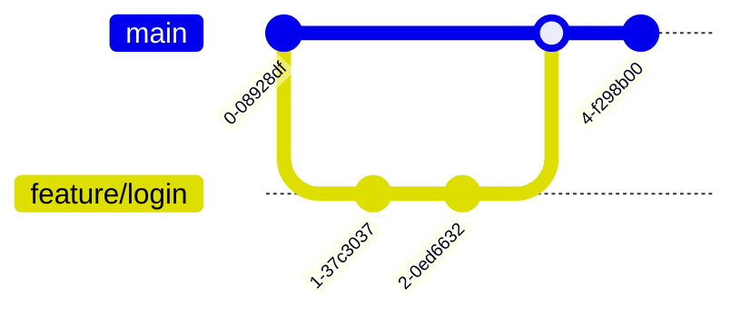

# 分支管理

本章定义 Git 分支的管理策略，包括分支模型选择、命名规范、保护规则等。

## 分支模型

### 模型选择策略

根据项目类型选择合适的分支模型：

| 项目类型 | 推荐模型 | 分支结构 | 发布方式 |
|---------|---------|---------|----------|
| Web 应用 | GitHub Flow | main + feature | 持续部署 |
| 微服务 | GitHub Flow | main + feature | 持续部署 |
| SDK/库 | Git Flow | main + develop + feature/release/hotfix | 版本发布 |
| 移动应用 | Git Flow | main + develop + feature/release/hotfix | 商店发布 |

### GitHub Flow

适用于持续部署的项目：



**工作流程**：
1. 从 main 创建功能分支
2. 在功能分支上开发
3. 创建 Pull Request
4. 代码审查和测试
5. 合并到 main
6. 自动部署

### Git Flow

适用于需要版本管理的项目：


**工作流程**：
1. 日常开发在 develop 分支
2. 功能开发创建 feature 分支
3. 发布准备创建 release 分支
4. 发布后合并到 main 和 develop
5. 紧急修复使用 hotfix 分支

## 分支命名规范

### 命名格式

```
<type>/<ticket>-<description>
```

- **type**: 分支类型
- **ticket**: 关联的任务票号（如 JIRA）
- **description**: 简短描述（kebab-case）

### 分支类型

| 类型 | 用途 | 示例 |
|------|------|------|
| feature | 新功能开发 | feature/JIRA-123-user-auth |
| fix | 问题修复 | fix/JIRA-456-login-error |
| hotfix | 紧急修复 | hotfix/JIRA-789-security-patch |
| release | 版本发布 | release/1.2.0 |
| chore | 杂项任务 | chore/JIRA-321-update-deps |

### 命名规则

```yaml
# 正确示例 ✅
feature/PROJ-123-add-payment
fix/PROJ-456-resolve-memory-leak
hotfix/PROJ-789-patch-security
release/2.1.0
chore/PROJ-111-upgrade-deps

# 错误示例 ❌
feature-user-login          # 缺少票号
PROJ-123                     # 缺少类型
add_payment                  # 使用下划线
Feature/PROJ-123-payment    # 类型大写
```

## 分支保护规则

### 主分支保护

main/master 分支必须启用以下保护：

```yaml
# GitHub 分支保护设置
protection_rules:
  main:
    # 基础保护
    require_pull_request: true
    required_approving_reviews: 1
    dismiss_stale_reviews: true
    require_code_owner_reviews: false
    
    # 合并前检查
    require_status_checks: true
    required_status_checks:
      - continuous-integration/travis-ci
      - lint
      - test
      - build
    
    # 其他限制
    restrict_push_access: false
    allow_force_pushes: false
    allow_deletions: false
    require_linear_history: false
    require_conversation_resolution: true
```

### develop 分支保护

对于使用 Git Flow 的项目：

```yaml
protection_rules:
  develop:
    require_pull_request: true
    required_approving_reviews: 1
    require_status_checks: true
    required_status_checks:
      - lint
      - test
    allow_force_pushes: false
```

## 分支生命周期

### 创建时机

- **feature**: Sprint 开始或任务分配时
- **fix**: 问题确认后
- **hotfix**: 生产事故发生时
- **release**: 版本功能完成后

### 合并策略

根据 PR 类型选择合并方式：

| PR 类型 | 合并策略 | 说明 |
|---------|---------|------|
| 小功能（<5 commits） | Squash and merge | 压缩为一个提交 |
| 大功能（≥5 commits） | Rebase and merge | 保留提交历史 |
| 紧急修复 | Create a merge commit | 保留完整上下文 |
| 依赖更新 | Squash and merge | 简化历史 |

### 清理策略

```bash
# 自动删除（推荐）
- PR 合并后自动删除源分支
- GitHub/GitLab 仓库设置中启用

# 手动清理本地分支
git branch -d feature/completed-feature
git remote prune origin

# 批量清理已合并分支
git branch --merged | grep -v "main\|develop" | xargs -n 1 git branch -d
```

## 分支操作规范

### 创建分支

```bash
# 1. 确保本地 main 最新
git checkout main
git pull origin main

# 2. 创建并切换到新分支
git checkout -b feature/JIRA-123-new-feature

# 3. 推送到远程
git push -u origin feature/JIRA-123-new-feature
```

### 更新分支

```bash
# 推荐：使用 rebase 保持线性历史
git checkout feature/my-feature
git fetch origin
git rebase origin/main

# 处理冲突后
git rebase --continue

# 强制推送到个人分支
git push --force-with-lease origin feature/my-feature
```

### 合并分支

```bash
# 通过 PR/MR 合并（推荐）
# 1. 推送分支
git push origin feature/my-feature

# 2. 在平台上创建 PR
# 3. 等待审查和 CI
# 4. 合并后自动删除远程分支

# 本地清理
git checkout main
git pull origin main
git branch -d feature/my-feature
```

## 特殊场景处理

### 长期功能分支

对于开发周期超过 2 周的功能：

```bash
# 定期同步主分支
git checkout feature/long-term
git rebase origin/main  # 每周至少一次

# 考虑拆分为多个小 PR
# 使用功能开关（feature flags）逐步上线
```

### 实验性分支

```bash
# 使用明确的前缀
experimental/new-architecture
poc/new-framework

# 设置过期时间
# 在 README 中标注实验目的和截止日期
```

### 紧急修复流程

```bash
# Git Flow 项目
git checkout -b hotfix/JIRA-999-critical-fix main
# 修复后合并到 main 和 develop

# GitHub Flow 项目
git checkout -b fix/JIRA-999-critical-fix main
# 直接 PR 到 main，标记为紧急
```

## 权限管理

### 强制推送权限

```yaml
force_push_rules:
  # 仅允许推送到个人分支
  allowed_patterns:
    - "feature/*"
    - "fix/*"
    - "chore/*"
  
  # 禁止推送到公共分支
  protected_patterns:
    - "main"
    - "master" 
    - "develop"
    - "release/*"
    - "hotfix/*"
```

### 分支创建权限

```yaml
branch_creation_rules:
  # 开发者可创建
  developer_can_create:
    - "feature/*"
    - "fix/*"
    - "chore/*"
  
  # 需要更高权限
  maintainer_required:
    - "release/*"
    - "hotfix/*"
```

## 常见问题

### 分支命名冲突？

```bash
# 使用更具体的描述
feature/JIRA-123-user-auth-oauth2  # 而不是 feature/JIRA-123-auth

# 或添加用户前缀（临时方案）
feature/JIRA-123-john-user-auth
```

### 忘记从最新 main 创建分支？

```bash
# 使用 rebase 更新基点
git rebase --onto main old-base feature/my-feature

# 或者重新创建（如果还没有太多提交）
git checkout main
git pull
git checkout -b feature/new-branch
git cherry-pick <commits>
```

### 分支偏离太远？

```bash
# 定期 rebase（推荐）
git rebase origin/main

# 如果冲突太多，考虑：
# 1. 拆分为更小的 PR
# 2. 与团队协调合并顺序
# 3. 使用 merge 而不是 rebase（最后选择）
```

## 最佳实践

### DO ✅

- 保持分支短生命周期（理想 < 1 周）
- 频繁同步主分支的更新
- 使用描述性的分支名称
- 删除已合并的分支
- 遵循项目选定的分支模型

### DON'T ❌

- 不要在公共分支上 rebase
- 避免长期存在的功能分支
- 不要直接在 main 上开发
- 避免使用通用名称（如 dev、test）
- 不要强制推送到公共分支

## 下一步

掌握分支管理后，请参考：
- [提交规范](./commit-convention) - 学习规范的提交信息格式
- [协作流程](./collaboration) - 了解 PR 和代码审查流程