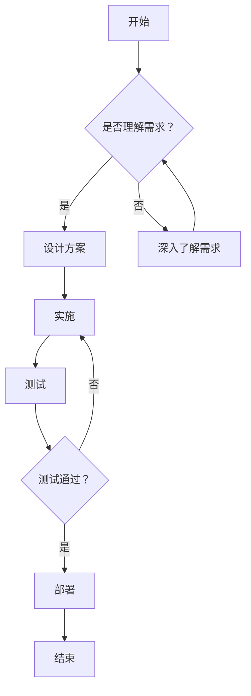
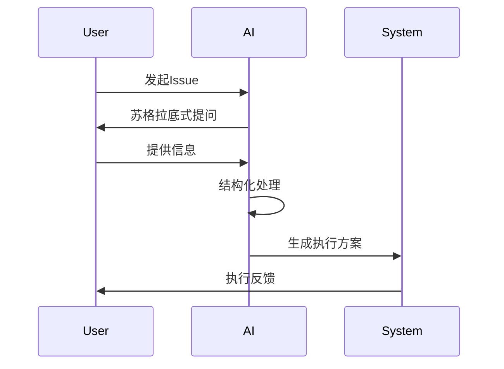
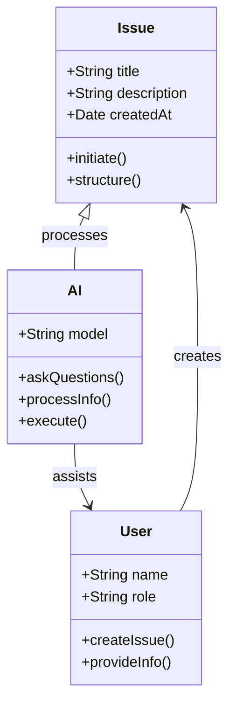
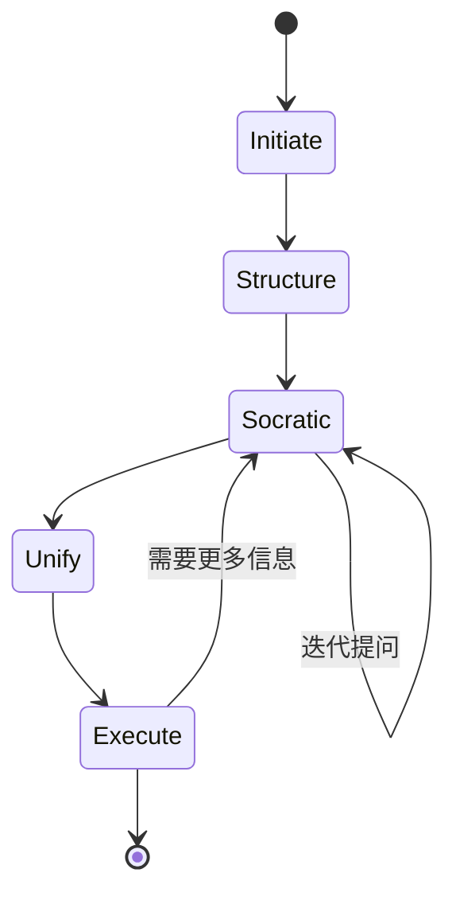

# Mermaid 图表测试

## 流程图

```mermaid
graph TD
    A[开始] --> B{是否理解需求？}
    B -->|是| C[设计方案]
    B -->|否| D[深入了解需求]
    C --> E[实施]
    D --> B
    E --> F[测试]
    F --> G{测试通过？}
    G -->|是| H[部署]
    G -->|否| E
    H --> I[结束]
```

## 序列图

```mermaid
sequenceDiagram
    participant User
    participant AI
    participant System
    
    User->>AI: 发起Issue
    AI->>User: 苏格拉底式提问
    User->>AI: 提供信息
    AI->>AI: 结构化处理
    AI->>System: 生成执行方案
    System->>User: 执行反馈
```

## 类图

```mermaid
classDiagram
    class Issue {
        +String title
        +String description
        +Date createdAt
        +initiate()
        +structure()
    }
    
    class AI {
        +String model
        +askQuestions()
        +processInfo()
        +execute()
    }
    
    class User {
        +String name
        +String role
        +createIssue()
        +provideInfo()
    }
    
    Issue <|-- AI : processes
    User --> Issue : creates
    AI --> User : assists
```

## 状态图

```mermaid
stateDiagram-v2
    [*] --> Initiate
    Initiate --> Structure
    Structure --> Socratic
    Socratic --> Unify
    Unify --> Execute
    Execute --> [*]
    
    Socratic --> Socratic : 迭代提问
    Execute --> Socratic : 需要更多信息
```